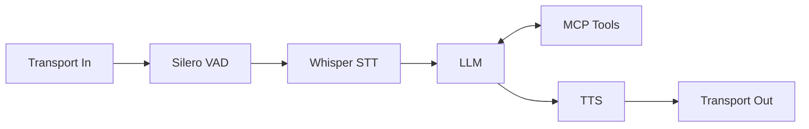

# Spark — Local voice agent

[](https://www.python.org/downloads/)

Pipecat-based voice agent with Silero VAD, Whisper STT, LM Studio LLM, and Kokoro/Piper/XTTS TTS. Run via CLI (mic/speaker), WebRTC (browser), or Daily.

## Table of contents

- [Features](#features)
- [Requirements](#requirements)
- [Quick start](#quick-start)
- [Installation](#installation)
- [Configuration](#configuration)
- [Running the agent](#running-the-agent)
- [Architecture](#architecture)
- [Docker](#docker)
- [What you see when you run](#what-you-see-when-you-run)
- [Troubleshooting](#troubleshooting)
- [See also](#see-also)

## Features

- **Local-first**: LM Studio on your machine (port 3000); optional TTS servers (Piper, XTTS).
- **Multiple TTS**: Kokoro (default, in-process), [Piper](https://github.com/rhasspy/piper), or [XTTS](https://github.com/coqui-ai/xtts-streaming-server).
- **Personalities**: `assistant`, `jarvis`, `storyteller`, `conspiracy`, `unhinged`, `sexy`, `argumentative` — each with distinct Kokoro voice pairs.
- **Modes**: CLI (local mic/speaker), WebRTC (browser client), or Daily (production-style); same pipeline.
- **Optional MCP tools**: Connect to an SSE MCP server (`MCP_SERVER_URL`); LLM can use tools (e.g. search, fetch page).
- **Docker**: Single-image run or [docker-compose.yml](docker-compose.yml) with optional [SearXNG](https://github.com/searxng/searxng) for MCP search.
- **AMD ROCm**: GPU passthrough in Docker; `HSA_OVERRIDE_GFX_VERSION` for older GPUs (e.g. RX 6600).

## Requirements

- **Python 3.10+**
- [uv](https://docs.astral.sh/uv/) (recommended) or pip + venv
- **LM Studio** running on port 3000 with a model loaded (e.g. `google_gemma-3-1b-it`)
- **TTS**: Default is **Kokoro** (in-process). Optional: Piper or XTTS server; set `TTS=piper` or `TTS=xtts` and the corresponding URL in `.env`.
- **Linux (local audio)**: `portaudio19-dev` and build tools — `sudo apt install portaudio19-dev build-essential`. Use `CC=gcc uv sync` if the build picks clang and fails.
- **Kokoro on Linux**: `sudo apt install espeak-ng`
- **AMD RX 6600 (gfx1050) with ROCm**: Set before running: `export HSA_OVERRIDE_GFX_VERSION=10.3.0`

<details>
<summary><strong>System and ROCm check</strong></summary>

Run the system check script to print CPU, RAM, GPU, and ROCm status:

```bash
./scripts/check_system.sh
```

This runs `rocm-smi` (and optionally `rocminfo`). Ensure ROCm is installed and the GPU is visible when using GPU workloads.

<details>
<summary><strong>AMD ROCm and HX99G setup</strong></summary>

The following targets **Minisforum HX99G** (and similar AMD systems). If you already have ROCm, skip to [Quick start](#quick-start).

**Install essentials and a supported kernel**

```bash
sudo apt update && sudo apt upgrade
sudo apt-get install neofetch htop wget curl
sudo apt install linux-image-generic
sudo add-apt-repository ppa:danielrichter2007/grub-customizer
sudo apt install grub-customizer
```

- Launch **Grub Customizer** → **General** tab → set default entry to **Advanced options for Ubuntu** → **Ubuntu, with Linux x.x.x-x-generic** → Save → `sudo reboot`
- Boot into that kernel, then install headers:

```bash
sudo apt install "linux-headers-$(uname -r)" "linux-modules-extra-$(uname -r)"
```

**Add users to render/video groups**

```bash
sudo usermod -a -G render,video $LOGNAME
echo 'ADD_EXTRA_GROUPS=1' | sudo tee -a /etc/adduser.conf
echo 'EXTRA_GROUPS=video' | sudo tee -a /etc/adduser.conf
echo 'EXTRA_GROUPS=render' | sudo tee -a /etc/adduser.conf
```

**Install AMDGPU and ROCm**

```bash
sudo apt update
wget https://repo.radeon.com/amdgpu-install/6.1.3/ubuntu/focal/amdgpu-install_6.1.60103-1_all.deb
sudo apt install ./amdgpu-install_6.1.60103-1_all.deb
sudo amdgpu-install --no-dkms --usecase=hiplibsdk,rocm
sudo rocminfo
sudo reboot
```

**Environment (if you hit unsupported-GPU errors)**

```bash
export HSA_OVERRIDE_GFX_VERSION=10.3.0
```

**Uninstall (if needed)**

```bash
amdgpu-install --uninstall
```

Full gist: [AMD ROCm installation (HX99G)](https://gist.github.com/furaar/ee05a5ef673302a8e653863b6eaedc90).

</details>

</details>

## Architecture

Audio flows from the transport (LocalAudio, WebRTC, or Daily) through Silero VAD and LocalSmartTurnAnalyzerV3 (smart-turn), then Whisper STT, LM Studio LLM, and Kokoro/Piper/XTTS TTS, back to the same transport. When `MCP_SERVER_URL` is set, MCP tools are registered with the LLM so it can call them mid-conversation; tool results re-enter the LLM before TTS.



- **Input**: LocalAudioTransport (CLI) or WebRTC/Daily (web).
- **VAD / turn**: Silero VAD + LocalSmartTurnAnalyzerV3.
- **STT**: Whisper (Faster Whisper); GPU when available (CUDA/ROCm), else CPU.
- **LLM**: LM Studio via OpenAI-compatible API.
- **MCP tools** (optional): When `MCP_SERVER_URL` is set, tools (e.g. search, fetch page) are registered with the LLM; the LLM can invoke them and use results before replying.
- **TTS**: Kokoro (in-process), or Piper/XTTS (HTTP server).
- **Output**: Same transport (speaker or browser).

## Quick start

```bash
cp .env.example .env
# Edit .env: set LM_MODEL (and optionally OPENAI_API_KEY) to match your LM Studio model
uv sync
# Start LM Studio on port 3000 and load the model
uv run python bot.py          # WebRTC → http://localhost:7860/client
# or
uv run python bot.py --local  # CLI (mic and speaker)
```

## Installation

1. **System dependencies** (see [Requirements](#requirements)): `portaudio19-dev`, `espeak-ng`, and for ROCm the steps in the collapsible above.
2. **Install project**:
   ```bash
   uv sync
   ```
   Or with pip:
   ```bash
   python -m venv .venv
   source .venv/bin/activate   # or .venv\Scripts\activate on Windows
   pip install -e .
   ```
   The package registers the `spark` entry point ([pyproject.toml](pyproject.toml)); you can run `uv run spark` instead of `uv run python bot.py`.
3. **Optional extras**: `uv sync --extra webrtc` (included by default), `uv sync --extra xtts` if using XTTS.

## Configuration

Copy [.env.example](.env.example) to `.env` and set the following.

| Variable | Description |
|----------|-------------|
| `HF_TOKEN` | Hugging Face token (for model downloads if needed) |
| `LM_STUDIO_BASE_URL` | LM Studio OpenAI-compatible API URL (default `http://localhost:3000/v1`) |
| `OPENAI_API_KEY` | Any non-empty value for LM Studio (e.g. `lm-studio`) |
| `LM_MODEL` | Exact model id as shown in LM Studio (e.g. `google_gemma-3-1b-it`) |
| `PERSONALITY` | `assistant`, `jarvis`, `storyteller`, `conspiracy`, `unhinged`, `sexy`, `argumentative` |
| `VOICE_GENDER` | `male` or `female`; default per personality if unset |
| `TTS` | `kokoro` (default), `piper`, or `xtts` |
| `KOKORO_VOICE` | Override personality voice (e.g. `af_heart`, `am_adam`); see [Kokoro VOICES.md](https://huggingface.co/hexgrad/Kokoro-82M/blob/main/VOICES.md) |
| `KOKORO_LANG` | Kokoro language code (default `a`) |
| `KOKORO_SPEED` | Speech speed 0.5–2.0 (default `1.0`) |
| `PIPER_BASE_URL` | Piper server URL when `TTS=piper` |
| `XTTS_BASE_URL` | XTTS server URL when `TTS=xtts` |
| `MCP_SERVER_URL` | Optional SSE MCP server (e.g. `http://localhost:8081/sse`); empty = no tools |
| `CONTEXT_MAX_MESSAGES` | Max messages sent to LLM (0 = no limit); system message always kept |
| `HSA_OVERRIDE_GFX_VERSION` | For AMD RX 6600 etc. (e.g. `10.3.0`) |

### Personality and voice

Each personality has a distinct Kokoro voice pair. Examples: **assistant** af_heart/am_michael, **jarvis** af_nicole/am_adam (default male), **storyteller** af_bella/am_puck, **conspiracy** af_sarah/am_onyx, **unhinged** af_bella/am_puck, **sexy** af_nicole/am_fenrir, **argumentative** af_bella/am_michael. Set `VOICE_GENDER=male` or `female` to choose; otherwise the personality default is used. Full list: [Kokoro VOICES.md](https://huggingface.co/hexgrad/Kokoro-82M/blob/main/VOICES.md). The LLM is instructed to output plain speech only (no parenthetical voice direction). **Voice emotes**: the LLM can start a phrase with `(excited)`, `(calm)`, `(whisper)`, `(sad)`, `(warm)` etc.; these are stripped and only affect speech speed.

### TTS

- **Kokoro** (default): In-process, no server. Voice from personality + `VOICE_GENDER` or `KOKORO_VOICE`. `KOKORO_LANG=a`, `KOKORO_SPEED=1.0` (0.5–2.0).
- **Piper** / **XTTS**: Run the server and set `TTS=piper` or `TTS=xtts` and `PIPER_BASE_URL` or `XTTS_BASE_URL`.

### MCP

When `MCP_SERVER_URL` is set (e.g. `http://localhost:8081/sse`), the bot connects at startup and registers MCP tools with the LLM so it can call them (e.g. search, fetch page). For search-backed tools you can run [docker-compose.yml](docker-compose.yml) with the optional **SearXNG** service and point your MCP stack (e.g. multi-mcp) at `SEARX_URL=http://localhost:8082`.

## Running the agent

| Mode | Command | Access |
|------|---------|--------|
| **Web client (default)** | `uv run python bot.py` or `uv run python bot.py -t webrtc` | http://localhost:7860/client |
| **CLI** | `uv run python bot.py --local` | Mic and speaker on this machine |
| **Interactive** | `uv run python bot.py -i` | Prompts for personality, mode, speed, voice gender |
| **Daily** | `uv run python bot.py -t daily` | Requires `DAILY_API_KEY` and `pipecat-ai[daily]`; see [UPGRADE.md](UPGRADE.md) |

**Convenience**: [run.sh](run.sh) runs local mode (`uv run python bot.py --local`).

## Docker

**Single container**

Build and run with LM Studio on the host (port 3000):

```bash
docker build -t spark-voice .
docker run -p 7860:7860 \
  -e LM_STUDIO_BASE_URL=http://host.docker.internal:3000/v1 \
  -e OPENAI_API_KEY=lm-studio \
  -e LM_MODEL=google_gemma-3-1b-it \
  spark-voice
```

On Linux, add `--add-host=host.docker.internal:host-gateway` if needed. Client: http://localhost:7860/client.

**Docker Compose**

[docker-compose.yml](docker-compose.yml) defines **spark-voice** (built from [Dockerfile](Dockerfile), env from `.env`, GPU devices for ROCm) and optional **SearXNG** (port 8082) for MCP search:

```bash
docker compose up -d --build
```

Then open http://localhost:7860/client. For CPU-only, comment out the `devices` section in `docker-compose.yml`. For AMD GPUs (e.g. RX 6600), set `HSA_OVERRIDE_GFX_VERSION=10.3.0` in `.env`. The image runs the runner with `--host 0.0.0.0` so the client is reachable from the host.

## What you see when you run

When you run `uv run python bot.py --local` (or the web client):

- **Pipecat banner** — Framework version and Python.
- **Smart Turn / Silero** — "Loading ... Loaded" for local turn and VAD models.
- **ALSA messages** — Lines like `pcm_dmix.c: unable to open slave` are common on Linux; the app usually still works with the default device.
- **Whisper** — "Loading Whisper model... Loaded Whisper model" (first run may download the model).
- **Pipeline linking** — "Linking ... -> ..." for each component (LocalAudio, Whisper, LLM, KokoroTTSService, etc.).
- **Kokoro** — First run may show "Defaulting repo_id to hexgrad/Kokoro-82M" and download `kokoro-v1_0.pth` (~327MB); then cached.
- **LM Studio** — "Generating chat from universal context" and TTFB; Kokoro then generates TTS from the reply and plays it.

If the LLM gives a long monologue instead of a short hello, the model may be ignoring the system prompt; try another model or a stricter prompt. The "No module named pip" at exit is from a dependency and is harmless when using `uv`.

## Troubleshooting

- **Whisper model not available**: Ensure `requests` is installed so the model can download from Hugging Face. First run can take a minute.
- **No TTS**: Default is Kokoro (no server). For Piper/XTTS set `TTS=piper` or `TTS=xtts` and the corresponding base URL.
- **LM Studio**: Server must be running on port 3000 with the model loaded; `LM_MODEL` must match the model id in LM Studio.
- **ROCm**: Run `./scripts/check_system.sh` and set `HSA_OVERRIDE_GFX_VERSION=10.3.0` for RX 6600.
- **Portaudio**: On Linux install `portaudio19-dev` for local audio. Use `CC=gcc uv sync` if the pyaudio build fails.
- **MCP tools not available**: Ensure `MCP_SERVER_URL` is correct and the MCP SSE server is running.

## See also

- [UPGRADE.md](UPGRADE.md) — Moving to GUI/web and production (Daily, custom client).
- [Pipecat](https://pipecat.ai/) — Voice pipeline framework.
- [LM Studio](https://lmstudio.ai/) — Local LLM server.
- [Kokoro-82M](https://huggingface.co/hexgrad/Kokoro-82M) — Kokoro TTS model and [VOICES.md](https://huggingface.co/hexgrad/Kokoro-82M/blob/main/VOICES.md).
